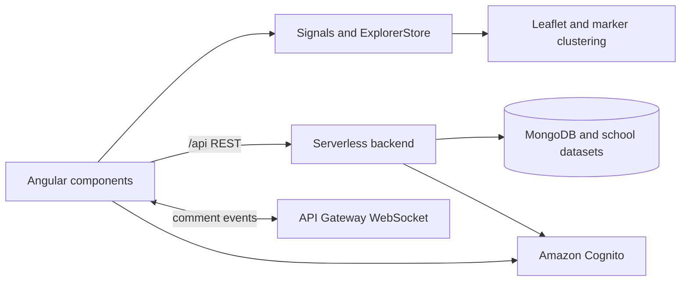

# K12Info frontend

**[View the live production site](https://k12info.com)**

K12Info is an interactive school-discovery application for exploring U.S. public and private schools. It brings school location, enrollment, classification, program, staffing, and civil-rights data into a searchable map experience, with deep-linked school profiles and real-time community comments.

This repository contains the Angular frontend. It communicates with a separately deployed serverless backend repository through REST endpoints and an API Gateway WebSocket endpoint.

## Product highlights

- Search for schools and geographic locations, then explore results on a synchronized Leaflet map and results sidebar.
- Filter public and private schools while respecting the different source schemas used by each sector.
- Open bookmarkable school pages with base NCES data and expanded CRDC details where available.
- Create Cognito-backed accounts with a separate MongoDB application profile and editable display username.
- Receive real-time comment creation and deletion updates across school pages, account settings, and browser tabs.
- Switch between responsive light and dark themes and map tile layers.

## Frontend architecture

K12Info uses standalone Angular components and signals for UI state. `ExplorerStore` owns the state shared among search, filters, map markers, the results list, selection, preview, and expanded details. Focus requests bridge this declarative state into Leaflet's imperative map API without making the map the source of truth.

Authentication has two related layers: Amazon Cognito owns credentials and session identity, while the backend stores application profiles and usernames in MongoDB. The UI is considered ready only after both the Cognito session and its application profile are resolved. `BroadcastChannel` keeps auth and profile changes synchronized across tabs.

REST remains the authoritative path for data. A shared WebSocket connection carries lightweight comment events; consumers then reconcile the affected comment through REST. Anonymous connections receive public school-topic events, while authenticated connections use a short-lived backend ticket and additionally receive user-topic events. School subscriptions survive reconnects and are released with the owning route.



## Technology and deployment

- Angular 22, TypeScript, Angular signals, reactive forms, and RxJS
- Leaflet with marker clustering for geospatial exploration
- AWS Amplify Auth with Amazon Cognito
- Vitest through Angular's unit-test builder
- GitHub Actions deployment using OIDC: production build → Amazon S3 → Amazon CloudFront cache invalidation

The browser uses relative `/api` URLs. During local development, Angular's proxy forwards them to the deployed backend; in production, the CloudFront/API configuration routes the same paths to the serverless API. WebSocket traffic connects directly to the configured API Gateway stage.

## Local development

Prerequisites: Node.js (the version in `.nvmrc`) and npm.

```bash
npm ci
npm start
```

Open <http://localhost:4200>. The development server uses `proxy.conf.json` for backend API requests.

Useful checks:

```bash
npm test
npm run build
```

The production build is emitted to `dist/frontend/browser/`.

## Repository guide

- `src/app/pages/explorer/` — search, filters, map, results, previews, and shared Explorer state
- `src/app/pages/school-details/` — deep-linked school data and comment experience
- `src/app/pages/settings/` — profile editing and the authenticated user's comments
- `src/app/services/` — authentication, profile, REST, theme, and WebSocket coordination
- `.github/workflows/deploy.yml` — S3/CloudFront production deployment
